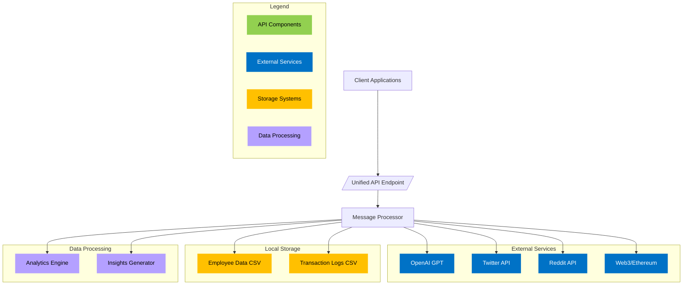

# PayZoll API Documentation

PayZoll is a revolutionary payroll platform that integrates Web3 technology with AI-driven automation. This Flask-based API simplifies crypto payroll management by handling multi-chain transactions, stable token swaps, and efficient fiat off-ramps while maintaining a user-friendly interface similar to traditional payroll systems.

## Installation

First, clone the repository and install dependencies:

```bash
git clone https://github.com/PayZoll/Web-Agent.git
cd server
pip install -r requirements.txt
cd ../client
npm i
```

Create a `.env` file with required environment variables:

```bash
OPENAI_API_KEY=your_openai_key
BEARER_KEY=your_bearer_token
CONSUMER_KEY=your_consumer_key
CONSUMER_SECRET=your_consumer_secret
ACCESS_KEY=your_access_key
ACCESS_SECRET=your_access_secret
REDDIT_CLIENT_ID=your_reddit_client_id
REDDIT_CLIENT_SECRET=your_reddit_client_secret
REDDIT_USERNAME=your_reddit_username
REDDIT_PASSWORD=your_reddit_password
PRIVATE_KEY=your_ethereum_private_key
```

## System Architecture

The PayZoll API operates as a unified platform integrating multiple services through a single entry point. Here's the high-level architecture:



The diagram above illustrates the core architecture of PayZoll API, where:

- Green components represent API endpoints and processing layers
- Blue components show external service integrations
- Yellow represents local storage systems
- Purple indicates data processing components

All requests flow through the unified API endpoint, which routes them to appropriate services or processing components based on the message content.

## Component Relationships

Here's how the different functions within the API interact:

```mermaid
sequenceDiagram
    participant Client
    participant API as Unified API
    participant Processor as Message Processor
    participant GPT as OpenAI GPT
    participant Twitter as Twitter API
    participant Reddit as Reddit API
    participant Web3 as Ethereum
    participant CSV as Local Storage

    Client->>+API: POST /api {"message": "..."}
    
    alt Invalid Message
        API-->>Client: {"status": "error", "message": "No message provided"}
    else Valid Message
        API->>+Processor: process_and_execute_message(message)
        
        Processor->>+GPT: Analyze request
        
        alt Chat Request
            GPT-->>-Processor: Function: chat_with_ai
            Processor->>+GPT: Execute chat function
            GPT-->>-Processor: AI Response
            Processor-->>-API: {"status": "success", ...}
            
        else Social Media Post
            GPT-->>-Processor: Function: generate_post
            Processor->>+GPT: Generate post content
            GPT-->>-Processor: Generated content
            alt Twitter
                Processor->>+Twitter: Create tweet
                Twitter-->>-Processor: Tweet posted
            else Reddit
                Processor->>+Reddit: Submit post
                Reddit-->>-Processor: Post submitted
            end
            Processor-->>-API: {"status": "success", ...}
            
        else Payroll Processing
            GPT-->>-Processor: Function: silent_bulk_transfer
            Processor->>+Web3: Execute transfers
            Web3-->>-Processor: Transaction receipts
            Processor->>+CSV: Log transactions
            CSV-->>-Processor: Logging complete
            Processor-->>-API: {"status": "success", ...}
            
        else Analytics Request
            GPT-->>-Processor: Function: employee_analytics
            Processor->>+CSV: Read employee data
            CSV-->>-Processor: Employee records
            Processor->>+GPT: Generate insights
            GPT-->>-Processor: Analytics report
            Processor-->>-API: {"status": "success", ...}
            
        end
        
        Client-->>-API: Response
    end
```

The sequence diagram above illustrates the complete lifecycle of a request through the PayZoll API, showing how different types of requests (chat, social media posts, payroll processing, and analytics) are handled through distinct paths while maintaining a unified entry point. Each request flows through the Message Processor, which determines the appropriate function to execute based on the message content.

## Usage Examples

Send requests to the API endpoint using JSON format:

```json
{
    "message": "Generate a Twitter post about our new product launch"
}

{
    "message": "Process bulk transfer for employees"
}

{
    "message": "Analyze employee salary trends"
}
```

## Available Functions

1. **Chat with AI**  - Function: `chat_with_ai`

- Purpose: Engage in conversation with the AI assistant
- Example Message: "What are the benefits of blockchain payroll?"

2. **Social Media Posts**  - Function: `generate_post`

- Purpose: Generate social media content for Twitter or Reddit
- Example Message: "Generate a Twitter post about our product launch"

3. **Payroll Processing**  - Function: `silent_bulk_transfer`

- Purpose: Execute bulk Sonic transfers to employees
- Parameters Required:
  - RPC URL for Sonic node
  - JSON string containing employee data and salaries

4. **Analytics**  - Function: `employee_analytics`

- Purpose: Generate insights from employee data
- Returns: Total employees, average salary, work hours analysis

5. **Transaction Insights**  - Function: `transaction_insights`

- Purpose: Analyze transaction logs using OpenAI
- Generates detailed reports on payroll transactions

## Error Handling

All API responses follow a standardized format:

```json
{
    "status": "success/error",
    "message": "Operation result or error description",
    "data": {}  // Optional data payload
}
```

## Security Considerations

1. **Environment Variables**  - All sensitive credentials are stored in `.env` files

- Never commit `.env` files to version control
- Use secure methods to manage environment variables in production

2. **API Security**  - All requests require proper JSON formatting

- Input validation occurs at multiple levels
- Error responses are sanitized to prevent information leakage

3. **Web3 Security**  - Private keys are stored securely in environment variables

- Transaction signing occurs locally
- Gas parameters are optimized for security and efficiency

## Development Notes

To run the development server:

```bash
python app.py
```

The Client is availabel at `http://web-agent-client.onrender/`
The API will be available at `http://web-agent-server.onrender/api`
