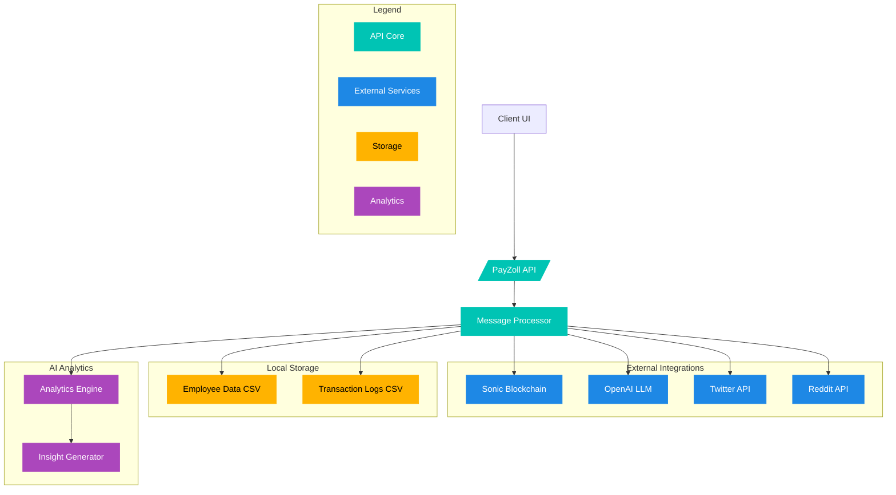
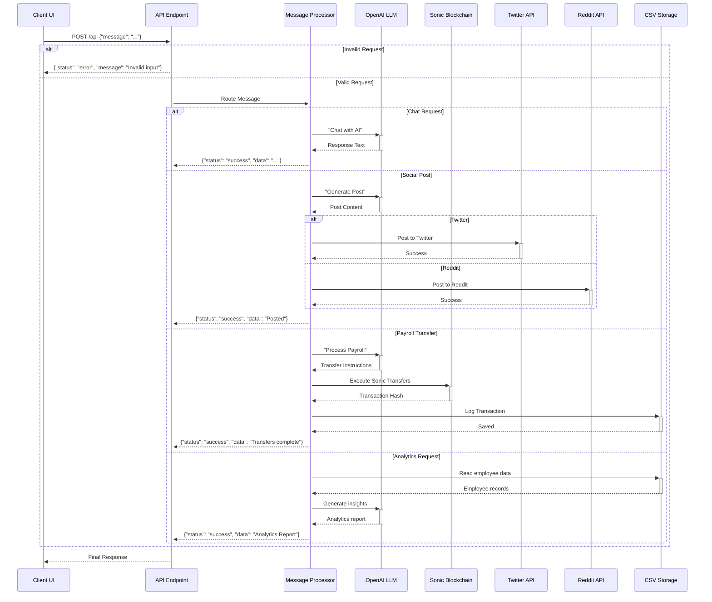

# PayZoll Agent Documentation

PayZoll is a revolutionary payroll platform that integrates Web3 technology with AI-driven automation. This Flask-based API simplifies crypto payroll management by handling multi-chain transactions, stable token swaps, and efficient fiat off-ramps while maintaining a user-friendly interface similar to traditional payroll systems.

## Installation

First, clone the repository and install dependencies:

```bash
git clone https://github.com/PayZoll/Web-Agent.git
cd server
pip install -r requirements.txt
cd ../client
npm i
```

Create a `.env` file with required environment variables:

```bash
OPENAI_API_KEY=your_openai_key
BEARER_KEY=your_bearer_token
CONSUMER_KEY=your_consumer_key
CONSUMER_SECRET=your_consumer_secret
ACCESS_KEY=your_access_key
ACCESS_SECRET=your_access_secret
REDDIT_CLIENT_ID=your_reddit_client_id
REDDIT_CLIENT_SECRET=your_reddit_client_secret
REDDIT_USERNAME=your_reddit_username
REDDIT_PASSWORD=your_reddit_password
PRIVATE_KEY=your_ethereum_private_key
```

## System Architecture

The PayZoll API operates as a unified platform integrating multiple services through a single entry point. Here's the high-level architecture:



- **API Core**: Routes all requests efficiently.
- **Services**: Sonic for transactions, OpenAI for LLMs, Twitter/Reddit for social.
- **Storage**: Local CSV for employee data and logs.
- **Analytics**: AI-driven insights from payroll data.

---

## 🔄 Request Flow

See how requests travel through the system:



The sequence diagram above illustrates the complete lifecycle of a request through the PayZoll API, showing how different types of requests (chat, social media posts, payroll processing, and analytics) are handled through distinct paths while maintaining a unified entry point. Each request flows through the Message Processor, which determines the appropriate function to execute based on the message content.

## Usage Examples

Send requests to the API endpoint using JSON format:

```json
{
    "message": "Generate a Twitter post about our new product launch"
}

{
    "message": "Process bulk transfer for employees"
}

{
    "message": "Analyze employee salary trends"
}
```

## Available Functions

1. **Chat with AI**  - Function: `chat_with_ai`

- Purpose: Engage in conversation with the AI assistant
- Example Message: "What are the benefits of blockchain payroll?"

2. **Social Media Posts**  - Function: `generate_post`

- Purpose: Generate social media content for Twitter or Reddit
- Example Message: "Generate a Twitter post about our product launch"

3. **Payroll Processing**  - Function: `silent_bulk_transfer`

- Purpose: Execute bulk Sonic transfers to employees
- Parameters Required:
  - RPC URL for Sonic node
  - JSON string containing employee data and salaries

4. **Analytics**  - Function: `employee_analytics`

- Purpose: Generate insights from employee data
- Returns: Total employees, average salary, work hours analysis

5. **Transaction Insights**  - Function: `transaction_insights`

- Purpose: Analyze transaction logs using OpenAI
- Generates detailed reports on payroll transactions

## Error Handling

All API responses follow a standardized format:

```json
{
    "status": "success/error",
    "message": "Operation result or error description",
    "data": {}  // Optional data payload
}
```

## Security Considerations

1. **Environment Variables**  - All sensitive credentials are stored in `.env` files

- Never commit `.env` files to version control
- Use secure methods to manage environment variables in production

2. **API Security**  - All requests require proper JSON formatting

- Input validation occurs at multiple levels
- Error responses are sanitized to prevent information leakage

3. **Web3 Security**  - Private keys are stored securely in environment variables

- Transaction signing occurs locally
- Gas parameters are optimized for security and efficiency

## Development Notes

To run the development server:

```bash
python web_agent_4o.py
