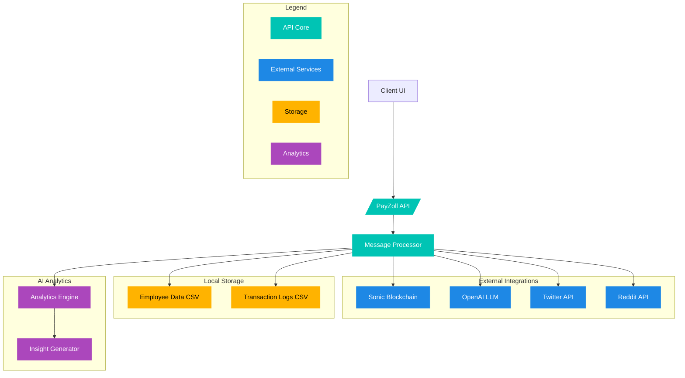
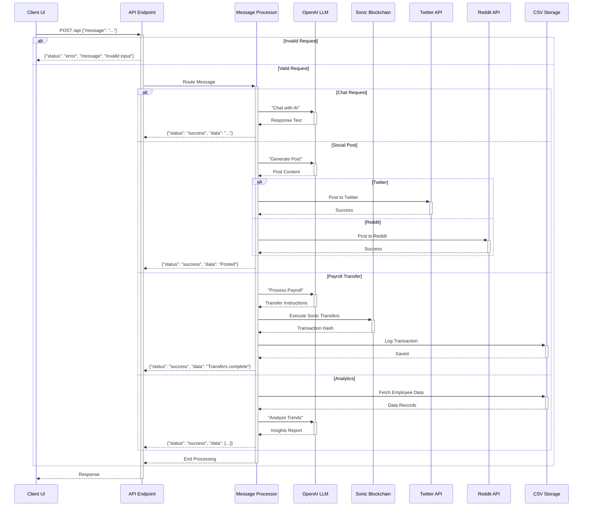

# PayZoll Web-Agent: Next-Gen Payroll Automation 🚀

Welcome to **PayZoll Web-Agent**, a state-of-the-art API that redefines payroll management by blending Web3 blockchain technology, AI-driven automation, and a sleek, user-friendly interface. Built with the latest tech stacks and powered by advanced Large Language Models (LLMs), PayZoll delivers seamless transactions, insightful data analytics, and an unparalleled user experience—making crypto payroll accessible, efficient, and future-ready.

**Live Client**: [http://web-agent-client.onrender/](http://web-agent-client.onrender/)  
**Live API**: [http://web-agent-server.onrender/api](http://web-agent-server.onrender/api)  
**Repository**: [PayZoll/Web-Agent](https://github.com/PayZoll/Web-Agent)  
**Star us**: Give us a ⭐ to support the future of payroll!

---

## 🌟 What Sets PayZoll Web-Agent Apart

PayZoll Web-Agent isn’t just an API—it’s a game-changer for payroll systems. Here’s why:

- **Seamless Transactions**: Execute global payroll with Sonic-speed blockchain transfers.
- **Advanced Analytics**: Unlock actionable insights from employee and transaction data with AI.
- **Stunning UI**: A modern, intuitive interface that abstracts Web3 complexity.
- **Latest Tech**: Built with Flask, Node.js, Sonic blockchain, and cutting-edge LLMs.
- **Scalable Design**: Handles 10 employees or 10,000 with ease.

> "PayZoll Web-Agent fuses blockchain’s power with AI’s intelligence and a UI that feels like magic—payroll has never been this effortless."  
> — Team PayZoll

---

## 🎨 Core Features

| Feature                | Description                                                                 |
|------------------------|-----------------------------------------------------------------------------|
| **Instant Payroll**       | Multi-chain Sonic transfers for global payments in seconds.              |
| **AI-Powered Insights**   | Deep analytics on salaries, hours, and transactions via LLMs.            |
| **Modern UI/UX**          | A client interface that’s as beautiful as it is functional.              |
| **Stablecoin Swaps**      | Auto-converts payments to USDT or other stablecoins for consistency.     |
| **Social Integration**    | Generate and post payroll updates to Twitter/Reddit effortlessly.        |

---

## 🛠️ Installation & Setup

Get PayZoll Web-Agent running locally in minutes.

### Prerequisites

- **Python 3.9+**: For the Flask-based server.
- **Node.js 18+**: For the client frontend.
- **pip**: Python package manager.
- **npm**: Node package manager.
- **Sonic Node RPC**: For blockchain interactions.

### Step-by-Step Installation

1. **Clone the Repository**  

   ```bash
   git clone https://github.com/PayZoll/Web-Agent.git
   cd Web-Agent
   ```

2. **Set Up the Server**  

   ```bash
   cd server
   pip install -r requirements.txt
   ```

3. **Set Up the Client**  

   ```bash
   cd ../client
   npm i
   ```

4. **Configure Environment Variables**  
   Create a `.env` file in the `server/` directory:

   ```bash
   OPENAI_API_KEY=your_openai_key
   BEARER_KEY=your_bearer_token
   CONSUMER_KEY=your_consumer_key
   CONSUMER_SECRET=your_consumer_secret
   ACCESS_KEY=your_access_key
   ACCESS_SECRET=your_access_secret
   REDDIT_CLIENT_ID=your_reddit_client_id
   REDDIT_CLIENT_SECRET=your_reddit_client_secret
   REDDIT_USERNAME=your_reddit_username
   REDDIT_PASSWORD=your_reddit_password
   PRIVATE_KEY=your_ethereum_private_key
   SONIC_RPC_URL=your_sonic_node_url
   ```

5. **Run the Server**  

   ```bash
   cd server
   python app.py
   ```

6. **Run the Client**  

   ```bash
   cd ../client
   npm start
   ```

   - Server runs at `http://localhost:5000/api`
   - Client runs at `http://localhost:3000`

---

## 🏗️ System Architecture

PayZoll Web-Agent is a unified platform integrating blockchain, AI, and social services. Here’s the architecture:



- **API Core**: Routes all requests efficiently.
- **Services**: Sonic for transactions, OpenAI for LLMs, Twitter/Reddit for social.
- **Storage**: Local CSV for employee data and logs.
- **Analytics**: AI-driven insights from payroll data.

---

## 🔄 Request Flow

See how requests travel through the system:



This flow showcases the API’s ability to handle diverse tasks—chat, social posts, payroll, and analytics—with a unified entry point.

---

## 🚀 Usage Examples

Interact with the API via JSON requests:

1. **Chat with AI**  

   ```json
   {
       "message": "Explain blockchain payroll benefits"
   }
   ```

   *Response*: AI-generated explanation.

2. **Social Media Post**  

   ```json
   {
       "message": "Announce our payroll upgrade on Twitter"
   }
   ```

   *Response*: Tweet posted confirmation.

3. **Payroll Processing**  

   ```json
   {
       "message": "Process bulk payroll for employees"
   }
   ```

   *Response*: Transaction details.

4. **Analytics**  

   ```json
   {
       "message": "Show salary trends for Q1 2025"
   }
   ```

   *Response*: Detailed report.

---

## 🧰 Available Functions

1. **`chat_with_ai`**  
   - **Purpose**: Conversational AI responses.  
   - **Input**: Any query.  
   - **Output**: Text response.

2. **`generate_post`**  
   - **Purpose**: Create social media content.  
   - **Input**: Platform + topic.  
   - **Output**: Posted content ID.

3. **`silent_bulk_transfer`**  
   - **Purpose**: Execute payroll via Sonic blockchain.  
   - **Input**: Employee JSON + RPC URL.  
   - **Output**: Transaction receipts.

4. **`complete_bulk_transfer`**  
   - **Purpose**: Execute payroll via Sonic blockchain.  
   - **Input**: ,
   - **Output**: Transaction receipts.

5. **`employee_analytics`**  
   - **Purpose**: Analyze employee data.  
   - **Output**: Metrics (e.g., avg salary, hours).

6. **`transaction_insights`**  
   - **Purpose**: Deep dive into transaction logs.  
   - **Output**: LLM-generated report.

---

## 🔒 Security & Best Practices

- **Credentials**: Stored in `.env`—never commit to Git.
- **Validation**: Multi-layer input checks prevent errors.
- **Web3**: Private keys encrypted; gas optimized for safety.
- **Logs**: Sanitized responses avoid data leaks.

---

## 🌐 Tech Stack

| Component       | Technology            |
|-----------------|-----------------------|
| **Server**      | Flask (Python)        |
| **Client**      | Next  (Node.js)       |
| **Blockchain**  | Sonic + Ethereum      |
| **AI**          | OpenAI LLM            |
| **Storage**     | CSV (scalable to DB)  |
| **Social**      | Twitter/Reddit APIs   |

---

## 📈 Why PayZoll Web-Agent?

- **Seamless**: Sonic blockchain ensures fast, low-cost transfers.
- **Insightful**: LLMs turn raw data into business intelligence.
- **User-Friendly**: A React-based UI that’s sleek and intuitive.
- **Future-Proof**: Built with the latest stacks for scalability.

---

## 🤝 Contribute

Join us in shaping the future of payroll:

1. Fork the repo.
2. Branch out (`git checkout -b feature/awesome-idea`).
3. Commit (`git commit -m "Added brilliance"`).
4. Push (`git push origin feature/awesome-idea`).
5. Open a PR!

Questions? Hit us up on [GitHub Discussions](https://github.com/PayZoll/Web-Agent/discussions).

---

## 🔮 Vision

PayZoll Web-Agent is more than an API—it’s a blueprint for the future of work. With seamless Web3 transactions, AI-driven insights, and a UI that delights, we’re making payroll a competitive advantage for businesses worldwide.

**Star us** ⭐ | **Build with us** 🚀
